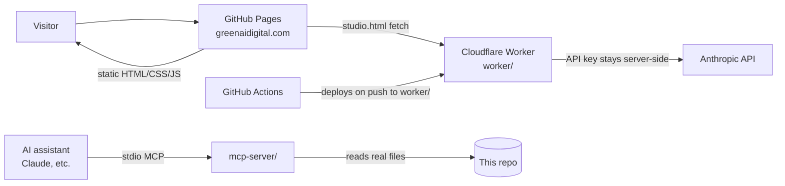

# GreenAI Solutions — greenaidigital.com

**The live website of GreenAI Solutions: an Arizona AI consulting and web studio, served straight from this repo via GitHub Pages — with a built-in MCP server so AI assistants can query the site like a database.**

[](https://greenaidigital.com)
[](LICENSE)


GreenAI Solutions (Gilbert, AZ) helps local businesses put AI to work — consulting, automation, social content, and custom web design. This repository is the production site: no framework, no build step, every page hand-built for speed.

## What's in here

| Area | Files | Description |
|---|---|---|
| Marketing site | `index.html`, `services.html`, `about.html`, `contact.html`, `testimonials.html` | Core public pages for greenaidigital.com |
| Legal & misc | `privacy.html`, `terms.html`, `404.html`, `thankyou.html` | Policies and utility pages |
| GreenAI Studio | `studio.html` + `worker/` | An in-browser AI tools suite backed by a Cloudflare Worker (keeps the Anthropic API key server-side; visitors use an access code) |
| Nexus AI portal | `portal.html`, `portal-signin.html`, `portal-signup.html`, `portal-dashboard.html` | "AI employee network" portal concept (demo/prototype) |
| AETHER | `aether/` | Immersive 3D Three.js microsite for the autonomous-agents service (also maintained standalone at [greenai-aether](https://github.com/GreenAiSolution/greenai-aether)) |
| Showcases & demos | `visuals*.html`, `experience.html`, `greenfit-ai-creator.html`, `content-studio.html`, `onboarding.html`, `marketing-campaign.html` | Interactive demos and internal marketing prototypes |
| MCP server | `mcp-server/` | Model Context Protocol server exposing the site to AI assistants |

The demo/prototype pages above are exactly that — working prototypes built to show what's possible, not claims of shipped client systems.

## Features

- **Zero-dependency static site** — pure HTML/CSS/JS, fast on GitHub Pages, custom domain via `CNAME`
- **Server-side AI proxy** — `worker/` is a Cloudflare Worker that fronts the Anthropic API for the Studio pages, deployed automatically by GitHub Actions (`.github/workflows/deploy-worker.yml`)
- **AI-native repo** — ships its own MCP server so Claude (or any MCP client) can inspect pages, metadata, links, and assets with real tools instead of raw file reads
- **SEO plumbing** — `sitemap.xml`, `robots.txt`, canonical/OG/Twitter meta on public pages

## Architecture



## Quickstart

```bash
git clone https://github.com/GreenAiSolution/greenai-solutions-group.git
cd greenai-solutions-group
python3 -m http.server 8080   # any static server works
# open http://localhost:8080
```

The Studio's AI tools require the Cloudflare Worker — see [`worker/README.md`](worker/README.md) for the 5-minute deploy.

## MCP Server

This repo is AI-native: `mcp-server/` contains a working stdio MCP server that turns the site into queryable tools.

| Tool | Purpose |
|---|---|
| `get_site_structure` | Every page with title, description, sitemap + robots status |
| `get_page_meta` | Full SEO/OG/Twitter metadata for one page |
| `search_content` | Text search across all site files with file:line results |
| `list_assets` | All assets with byte sizes, grouped by type |
| `check_internal_links` | Finds internal links pointing at missing files |
| `get_sitemap_report` | Cross-checks sitemap.xml against actual files |

```bash
cd mcp-server && npm install
claude mcp add greenai-solutions-group -- node mcp-server/server.mjs
```

Details in [`mcp-server/README.md`](mcp-server/README.md).

## Tech stack

- HTML5 / CSS3 / vanilla JavaScript (no framework, no build step)
- Three.js (CDN) for the AETHER 3D microsite
- Cloudflare Workers + GitHub Actions for the Studio AI backend
- Node.js + `@modelcontextprotocol/sdk` for the MCP server
- GitHub Pages hosting (master branch, custom domain)

## Deployment

Pushing to `master` is a production deploy — GitHub Pages serves this branch at greenaidigital.com directly. Changes inside `worker/` additionally trigger the Cloudflare Worker deploy workflow.

## License

[MIT](LICENSE) © 2026 GreenAI Solutions
